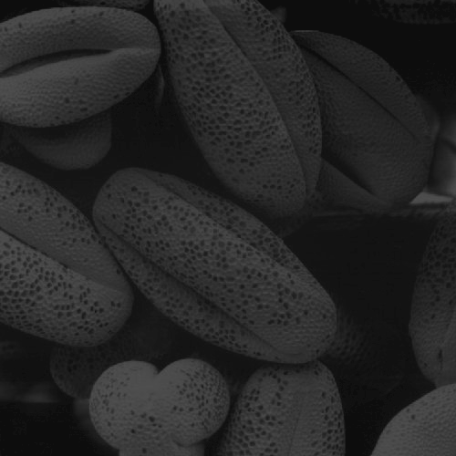
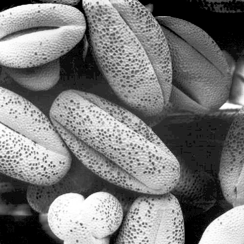
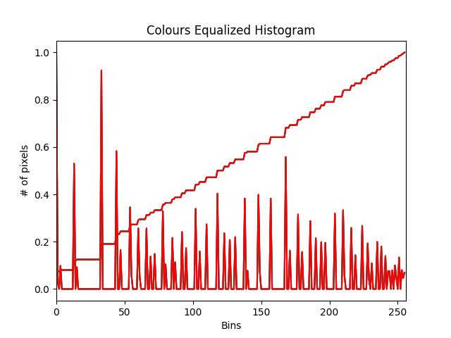
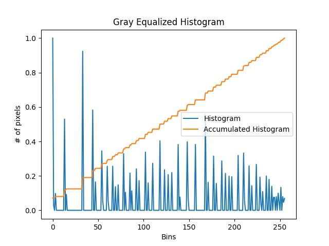
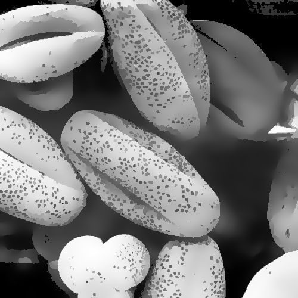
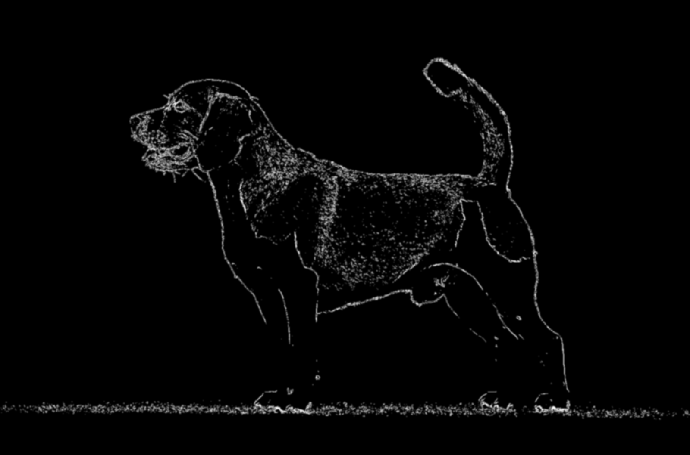
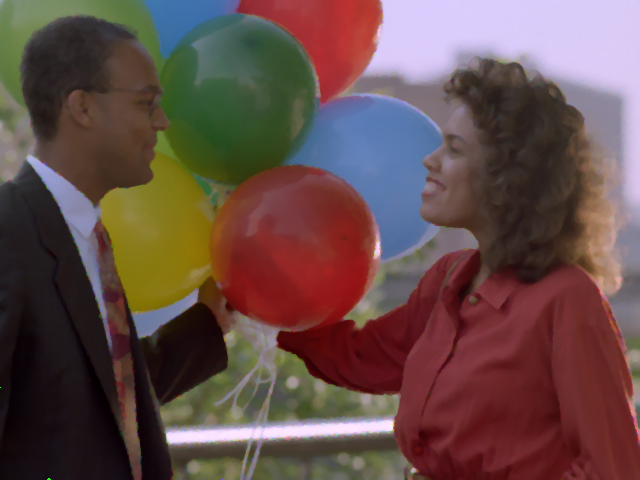
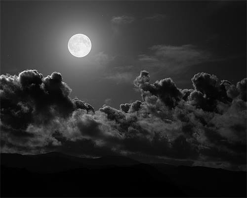
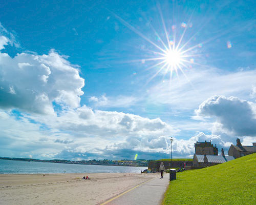
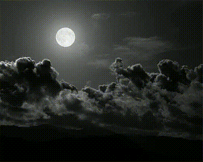

# Práctica 3: Procesamiento de imágenes.

Integrantes:
- Gerardo León Quintana
- Susana Suárez Mendoza

## Ejercicio 1.
El negativo de una imagen es el resultado de aplicar la siguiente operación: $255-imagen(i,j)$. Aplica esta operación sobre la `imagen2.png`m y, posteriormente, crea un video que vaya mezclando las dos imágenes por columnas, de forma que aparezca primero el negativo de la imagen y vaya apareciendo poco a poco la imagen original. El número de iteraciones debe ser igual al ancho de la imagen y en cada una se debe ir desplazando una columna a la derecha la imagen original sobre el negativo. Guarda el vídeo con el nombre `video2.mp4`. 

**Flujo del programa**
1. **Calcular el negativo** de la imagen segun la fórmula especificada.
   
$$negativo(i,j) = 255 - imagen(i,j)$$
```python
img = cv.imread('images/imagen2.png')
negative_image = 255 - img
```

2. **Generación del vídeo**. El número de iteraciones será igual al ancho de la imagen, y en cada iteración, la imagen original se desplazará una columna a la derecha sobre el negativo. En cada iteración se guarda el frame del video.

```python
for i in range(width):
    img_act = img.copy()
    img_act[:, i:] = negative_image[:, i:]
    video_writer.write(img_act)
```

3. **Mostrar el resultado final** en bucle.
```python
while True:
    ret, frame = video.read()
    if not ret:
        video.set(cv.CAP_PROP_POS_FRAMES, 0)
        continue
    cv.imshow('Original Image', img)
    cv.imshow('Video', frame)
    if cv.waitKey(1) & 0xFF == ord('q'):
        break
```
<div align="center">
  
    <p><strong>Figura 1.</strong> Video resultante del ejercicio 1.</p> 
</div>

## Ejercicio 2. 
Ecualiza el histograma de la imagen `imagen3.png` y luego elimina el ruido utilizando un filtro bilateral con un diámetro $d=10$ y valores de $\sigma$ de $11$ y $11$. Guarda el resultado como `imagen3_salida.png`.

**Flujo del programa**

1.**Ecualizado de la imagen**. En este paso, se realiza la ecualización del histograma de la imagen en escala de grises. Además, se ecualizan los canales de color por separado. Posteriormente, se muestran los histogramas correspondientes a las imágenes ecualizadas.

```python
gray = cv.cvtColor(img, cv.COLOR_BGR2GRAY)
gray_equalized = cv.equalizeHist(gray)
```

<div align="center">
   
|  |  |
|:--:|:--:|
| **Figura 2.** Imagen de entrada a color. | **Figura 3.** Imagen de entrada en escala de grises. |
   
</div>

<div align="center">
   
|  |  |
|:--:|:--:|
| **Figura 4.** Histograma ecualizado de la imagen de la Figura 2. | **Figura 5.** Histograma ecualizado de la imagen de la Figura 3.  |

</div>


2. **Eliminación del ruido**. Posteriormente, se aplica un filtro bilateral con un diámetro $d=10$ y valores de $\sigma$ en el espacio de color y en el espacio de intensidad de $11$ en ambas imágenes, la ecualizada en escala de grises y la ecualizada a color.

```python
# Filtro bilateral en la imagen en escala de grises
bilateral_gray_equalized = gray_equalized
for _ in range(10):
    bilateral_gray_equalized = cv.bilateralFilter(bilateral_gray_equalized, 10, 11, 11)
    image = bilateral_gray_equalized
    cv.imshow('Bilateral - gray_equalized', image)

# Filtro bilateral en la imagen con colores equalizados
bilateral_colours_equalized = colour_equalized
for _ in range(10):
    bilateral_colours_equalized = cv.bilateralFilter(bilateral_colours_equalized, 10, 11, 11)
    image = bilateral_colours_equalized
    cv.imshow('Bilateral - color_equalized', image)
```

Finalmente, las imágenes resultantes de la ecualización de color y el filtro bilateral se muestran en las siguientes figuras.

<div align="center">
   
|  |  |
|:--:|:--:|
| **Figura 6.** Filtro bilateral de la imagen a color. | **Figura 7.** Filtro bilateral de la imagen en escala de grises. |
   
</div>

Se guarda la imagen resultante de la equalización de color y el filtro bilateral en un archivo PNG ya que es aquella que proporciona mejores resultados.

## Ejercicio 3. 

Con la `imagen4.jpg`, crea un vídeo de 100 frames aplicando un filtro mediano de radio (`ksize`) igual a 7. Aplica el filtro en cada iteración al resultado de la iteración anterior. Guarda el vídeo con el nombre `video4.mp4`.

Para realizar dicha actividad se aplica un filtro de desenfoque de mediana y se guardan 100 fotogramas en el video, donde en cada iteración el filtro de desenfoque es aplicado progresivamente sobre la imagen.
```python
frames = 100
ksize = 7
current_img = img.copy()

for i in range(frames):
    current_img = cv.medianBlur(current_img, ksize)
    video_writer.write(current_img)
```

A continuación, en la Figura 8 se presenta el video generado, visualizado como un GIF que muestra el efecto de la aplicación iterativa del filtro de desenfoque.

<div align="center">
  
    <p><strong>Figura 8.</strong> Video resultante del ejercicio 3.</p> 
</div>

## Ejercicio 4.

Calcula la norma del gradiente de la `imagen5.jpg` utilizando los operadores de Sobel. Umbraliza los valores de la norma de forma que los valores mayores o iguales a 128 se igualen a 255 y los menores de 128 se igualen a 0. Finalmente, aplica un filtro Gaussiano de radio (7,7) con $\sigma$=-1. Guarda el resultado con el nombre `imagen5_salida.png`.

**Flujo del programa**

1. **Cálculo de la norma del gradiente**. Para ello, es necesario calcular los gradientes de la imagen en las direcciones x e y utilizando el operador Sobel y, luego, la magnitud del gradiente en cada píxel usando la fórmula de la distancia euclidia:
 $$\text{magnitud} = \sqrt{dx^2 + dy^2}$$
```python
dx = cv.Sobel(gray, cv.CV_64F, 1, 0)
dy = cv.Sobel(gray, cv.CV_64F, 0, 1)
norm = np.sqrt(dx**2 + dy**2)
norm = norm.astype(np.uint8)
```

2. **Aplicación del umbral**. Si un valor de píxel en norm es mayor o igual a 128, se convierte en 255 (blanco). Si es menor, se convierte en 0 (negro). Esto produce una imagen binaria (blanco y negro), destacando los bordes fuertes en la imagen.

```python
_, norm_thresh = cv.threshold(norm, 128, 255, cv.THRESH_BINARY)
```

3. **Aplicación de filtro gaussiano**. Se aplica un filtro Gaussiano con un kernel de tamaño 7x7 a la imagen con umbral (bordes). Este filtro suaviza la imagen para reducir el ruido o detalles no deseados.
```python
gaussian_filter = cv.GaussianBlur(norm_thresh, (7, 7), sigmaX=-1)
```

Finalmente, el resultado se presenta en la Figura 10, en la cual se pueden observar los bordes del animal, a excepción de las patas, cuyos bordes no se lograron calcular.

<div align="center">
   
|  |  |
|:--:|:--:|
| **Figura 9.** Imagen original. | **Figura 10.** Imagen de los bordes detectados. |
   
</div>

## Ejercicio 5.

Elimina el ruido de la `imagen6.png` con alguno de los algoritmos que conoces. Aplica el filtro múltiples veces para eliminar lo mejor posible el ruido. Guarda la imagen de salida con el nombre `imagen6_salida.png`.

Para lograr lo descrito en el ejercicio, se probaron tres tipos de filtros descritos a continuación:
1. **Filtro bilateral**. El filtro bilateral es un método de suavizado que preserva los bordes mientras elimina el ruido. A diferencia de los filtros de desenfoque estándar, como el desenfoque gaussiano, el filtro bilateral tiene en cuenta tanto la proximidad espacial de los píxeles como la similitud de sus colores.
```python
img_bilateral = img
for _ in range(5):
    img_bilateral = cv.bilateralFilter(img_bilateral, 10, 150, 120)
```

2. **Filtro de Desenfoque Mediano (Median Blur)**. El filtro de desenfoque mediano reemplaza el valor de un píxel con el valor mediano de los píxeles en su vecindario. Este tipo de filtro es particularmente efectivo para eliminar el "ruido de sal y pimienta", que se presenta como puntos blancos o negros en la imagen.

```python
img_blur = img
for _ in range(5):
    img_blur = cv.medianBlur(img_blur, 3)
```

3. **Filtro Gaussiano**. El filtro gaussiano suaviza la imagen al aplicar un promedio ponderado a los píxeles en su vecindario, donde los píxeles más cercanos al píxel central tienen mayor peso en el promedio.

```python
img_gaussian = img
for i in range(5):
    img_gaussian = cv.GaussianBlur(img_gaussian, (11, 11), 0)
```

Finalmente, las siguientes figuras muestran la imagen original y las imágenes resultantes de cada filtro. Tal y como se observa, se decide guardar la imagen a la que se le ha aplicado el filtro de desenfoque mediano ya que es aquella que proporciona un mejor resultado.

<div align="center">
   
|  |  |  | 
|:--:|:--:|:--:|:--:|
| **Figura 11.** Original. | **Figura 12.** Filtro bilateral. | **Figura 13.** Filtro Mediano. | **Figura 14.** Filtro Gaussiano. 
   
</div>

## Ejercicio 6.

Mezcla las imágenes `imagen7_1.jpg` e `imagen7_2.png` de forma no lineal utilizando la siguiente expresión:

$$ I_3 = \frac{ 1+ \cos{(\frac{\alpha}{180}\pi )}}{2} I_1 + \frac{ 1- \cos{(\frac{\alpha}{180}\pi )}}{2} I_2$$ 

Crea un vídeo de 360 frames aumentando el ángulo en 1° en cada iteración y guárdalo con el nombre de `video7.mp4`.

<div align="center">
   
|  |  |
|:--:|:--:|
| **Figura 15.** `Imagen7_1`. | **Figura 16.** `Imagen7_2`.  |

<\div>

1. **Definir la función de mezcla no lineal**. Esta función calcula la mezcla entre las dos imágenes `img_1` e `img_2` usando la fórmula matemática dada.
```python
def mixture(img_1, img_2, alpha):
    img_mix1 = ((1 + np.cos(np.pi * alpha / 180)) / 2) * img_1
    img_mix2 = ((1 - np.cos(np.pi * alpha / 180)) / 2) * img_2
    return img_mix1 + img_mix2
```

2. **Crear el video con las imágenes mezcladas**. 
```python
for alpha in range(frames):
    img_3 = mixture(img_1, img_2, alpha)
    img_3 = np.clip(img_3, 0, 255).astype(np.uint8)
    
    video_writer.write(img_3)
```

3. **Visualización del resultado en bucle**. Una vez almacenado el video, este se reproduce en un ciclo continuo, tal como se muestra en la Figura 17.

<div align="center">
  
    <p><strong>Figura 17.</strong> Video resultante del ejercicio 6.</p> 
</div>
