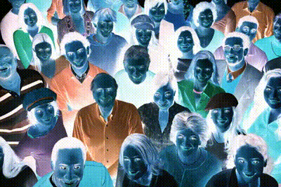
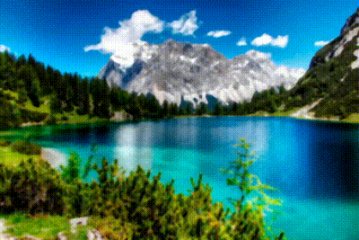

# Práctica 3: Procesamiento de imágenes.

Integrantes:
- Gerardo León Quintana
- Susana Suárez Mendoza

## Ejercicio 1.
El negativo de una imagen es el resultado de aplicar la siguiente operación: $255-imagen(i,j)$. Aplica esta operación sobre la `imagen2.png`m y, posteriormente, crea un video que vaya mezclando las dos imágenes por columnas, de forma que aparezca primero el negativo de la imagen y vaya apareciendo poco a poco la imagen original. El número de iteraciones debe ser igual al ancho de la imagen y en cada una se debe ir desplazando una columna a la derecha la imagen original sobre el negativo. Guarda el vídeo con el nombre `video2.mp4`. 

**Flujo del programa**
1. **Calcular el negativo** de la imagen segun la fórmula especificada.
   
$$negativo(i,j) = 255 - imagen(i,j)$$
```python
img = cv.imread('images/imagen2.png')
negative_image = 255 - img
```

2. **Generación del vídeo**. El número de iteraciones será igual al ancho de la imagen, y en cada iteración, la imagen original se desplazará una columna a la derecha sobre el negativo. En cada iteración se guarda el frame del video.

```python
for i in range(width):
    img_act = img.copy()
    img_act[:, i:] = negative_image[:, i:]
    video_writer.write(img_act)
```

3. **Mostrar el resultado final** en bucle.
```python
while True:
    ret, frame = video.read()
    if not ret:
        video.set(cv.CAP_PROP_POS_FRAMES, 0)
        continue
    cv.imshow('Original Image', img)
    cv.imshow('Video', frame)
    if cv.waitKey(1) & 0xFF == ord('q'):
        break
```
<div align="center">
  
    <p><strong>Figura 1.</strong> Video resultante del ejercicio 1.</p> 
</div>

## Ejercicio 2. 
Ecualiza el histograma de la imagen `imagen3.png` y luego elimina el ruido utilizando un filtro bilateral con un diámetro $d=10$ y valores de $\sigma$ de $11$ y $11$. Guarda el resultado como `imagen3_salida.png`.

**Flujo del programa**

1.**Ecualizado de la imagen**. En este paso, se realiza la ecualización del histograma de la imagen en escala de grises. Además, se ecualizan los canales de color por separado. Posteriormente, se muestran los histogramas correspondientes a las imágenes ecualizadas.

```python
gray = cv.cvtColor(img, cv.COLOR_BGR2GRAY)
gray_equalized = cv.equalizeHist(gray)
```

# FALTA PONER LAS DOS IMAGENES
# FAKTA PONER LOS HUISTOGAMAS

2. **Eliminación del ruido**. Posteriormente, se aplica un filtro bilateral con un diámetro $d=10$ y valores de $\sigma$ en el espacio de color y en el espacio de intensidad de $11$ en ambas imágenes, la ecualizada en escala de grises y la ecualizada a color.

```python
# Filtro bilateral en la imagen en escala de grises
bilateral_gray_equalized = gray_equalized
for _ in range(10):
    bilateral_gray_equalized = cv.bilateralFilter(bilateral_gray_equalized, 10, 11, 11)
    image = bilateral_gray_equalized
    cv.imshow('Bilateral - gray_equalized', image)

# Filtro bilateral en la imagen con colores equalizados
bilateral_colours_equalized = colour_equalized
for _ in range(10):
    bilateral_colours_equalized = cv.bilateralFilter(bilateral_colours_equalized, 10, 11, 11)
    image = bilateral_colours_equalized
    cv.imshow('Bilateral - color_equalized', image)
```

Finalmente, las imágenes resultantes de la ecualización de color y el filtro bilateral se muestran en las siguientes figuras.

# imageens

Se guarda la imagen resultante de la equalización de color y el filtro bilateral en un archivo PNG ya ue es aquella que proporciona mejores resultados.

## Ejercicio 3. 

Con la `imagen4.jpg`, crea un vídeo de 100 frames aplicando un filtro mediano de radio (`ksize`) igual a 7. Aplica el filtro en cada iteración al resultado de la iteración anterior. Guarda el vídeo con el nombre `video4.mp4`.

Para realizar dicha actividad se aplica un filtro de desenfoque de mediana y se guardan 100 fotogramas en el video, donde en cada iteración el filtro de desenfoque es aplicado progresivamente sobre la imagen.
```python
frames = 100
ksize = 7
current_img = img.copy()

for i in range(frames):
    current_img = cv.medianBlur(current_img, ksize)
    video_writer.write(current_img)
```

A continuación, en la Figura X se presenta el video generado, visualizado como un GIF que muestra el efecto de la aplicación iterativa del filtro de desenfoque.

<div align="center">
  
    <p><strong>Figura X.</strong> Video resultante del ejercicio 3.</p> 
</div>
